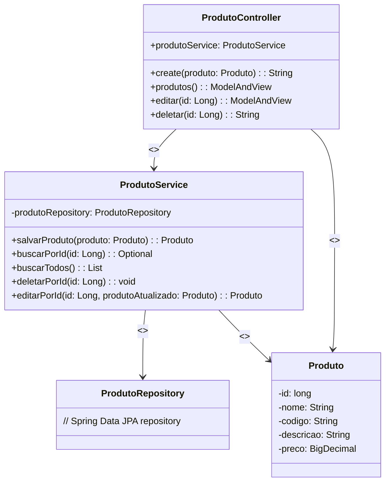

# Nunes Sports - Aplicação Web

## Visão Geral
Este é um projeto de aplicação web desenvolvida em Java com Spring Boot, Spring Data JPA, Thymeleaf, Lombok, HTML, CSS e Bootstrap. A aplicação permite aos usuários gerenciar uma lista de produtos, incluindo adição, edição e exclusão de produtos.

## Diagrama UML:




## Imagens da Aplicação:


## Tecnologias Utilizadas
- Java
- Spring Boot
- Spring Data JPA
- Thymeleaf
- Lombok
- MySQL (como banco de dados)
- HTML
- CSS
- Bootstrap

## Iniciando
Para executar a aplicação localmente, siga os passos abaixo:

1. Clone o repositório:
    ```bash
    git clone https://github.com/fhelipe27/nunes-sports
    ```
2. Abra o projeto em seu IDE preferido.
3. Configure a conexão com o banco de dados MySQL no arquivo application.properties. Certifique-se de criar o banco de dados antes de iniciar a aplicação.
4. Execute a aplicação.
5. Acesse a aplicação no navegador através do endereço http://localhost:8080/api/v1/produtos

## Funcionalidades
A aplicação oferece as seguintes funcionalidades:
- Adição de produtos através do formulário.
- Edição de produtos existentes.
- Exclusão de produtos da lista.
- Listagem geral dos produtos incluídos no banco de dados

## Estrutura do Projeto
- src/main/java/com/everymind/nunessports/controllers: Contém os controladores da aplicação.
- src/main/java/com/everymind/nunessports/services: Contém os serviços relacionados aos produtos.
- src/main/resources/templates: Contém os arquivos HTML usando Thymeleaf para renderizar as páginas.

## Contribuição
Sinta-se à vontade para contribuir com melhorias, correções de bugs ou novas funcionalidades. Abra um pull request e ficarei feliz em revisar.

